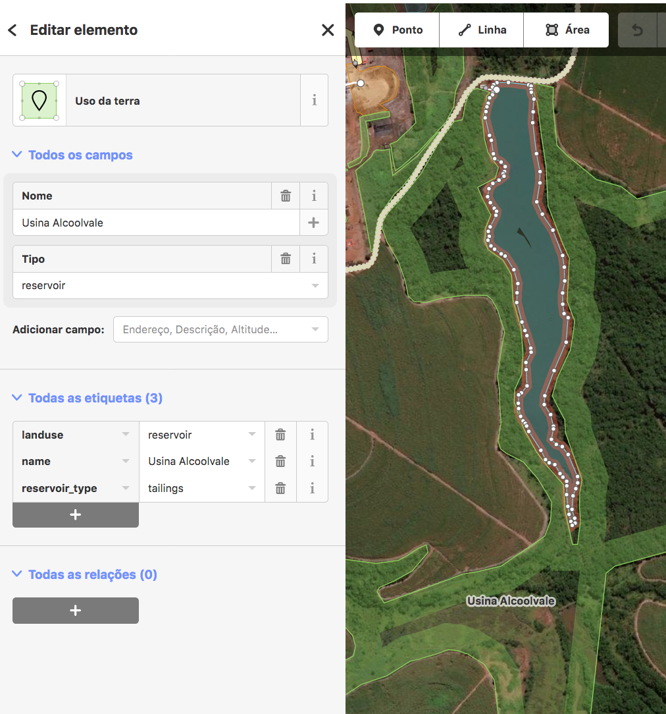

## Barragens de Rejeito

Dados em formato aberto sobre barragens de rejeito no Brasil, feitos pela comunidade do OpenStreetMap.

### baixe: [barrangens-de-rejeito.zip](https://github.com/vgeorge/barragens-de-rejeito/releases/latest)

## Objetivo

Este repositório foi criado para tonar mais acessíveis os dados no OpenStreetMap sobre barragens de rejeito. Com o uso de um script, os dados são baixados e transformados à maior variedade de formatos abertos possíveis.

## Como melhorar o mapa

Se você é novo no OpenStreetMap, [crie uma conta](https://www.openstreetmap.org/user/new) e siga o tutorial do editor para aprender mapeamento básico. Reservatórios podem ser mapeados a partir de imagens de satélite com certa facilidade, se a sua localização aproximada for conhecida. Aplica-se a combinação etiqueta/valor `reservoir_type=tailings` em objetos do tipo [linha](https://wiki.openstreetmap.org/wiki/Pt:Linha) ou [relação](https://wiki.openstreetmap.org/wiki/Pt:Relation). Este é um exemplo de uma barragem no editor web do OpenStreetMap:



Entre nos [canais da comunidade](https://wiki.openstreetmap.org/wiki/Pt:Contact) para tirar dúvidas e discutir as aspectos de mapeamento.

## Atualização dos dados

O processo de atualização é via linha de comando, sendo necessário um sistema *nix. Além do `curl` e `zip`, que geralmente já estão disponíveis, é preciso instalar as seguintes dependências:

* ogr2ogr
* osm2geojson
* geo2topo

Para gerar o arquivo `barragens-de-rejeito.zip`, rode o script:

    ./prepara.sh

Esta é a query usada no Overpass para trazer os dados de barragens de rejeito:

```
[out:json][timeout:25];
{{geocodeArea:Brazil}}->.searchArea;
(
  // query part for: “reservoir”
  way[reservoir_type="tailings"](area.searchArea);
  relation[reservoir_type="tailings"](area.searchArea);
);
// print results
out body;
>;
out skel qt;
```

[Executar chamada no Overpass Turbo](http://overpass-turbo.eu/s/x1t)

## Referências

* https://pt.wikipedia.org/wiki/Barragem_de_rejeito
* https://en.wikipedia.org/wiki/Tailings_dam

## Licença

Código: [MIT](LICENSE)

Dados: [ODbL](https://www.openstreetmap.org/copyright)
